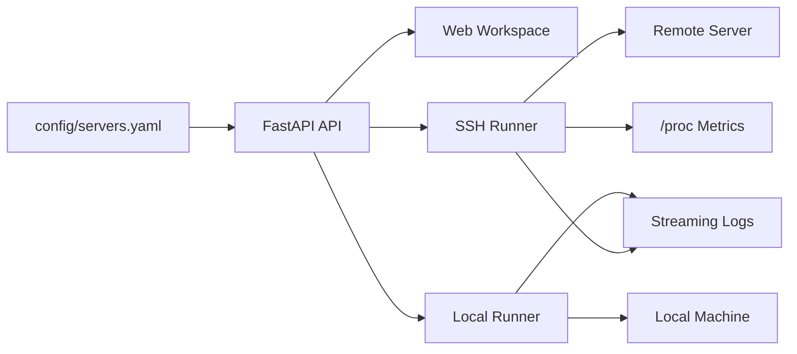

# Rem0teMan

本地优先的远端服务器管理工作台。

用 YAML 管理服务器与项目，用 FastAPI 提供 API，用可视化工作区完成 SSH 连接检测、脚本执行、实时日志、执行历史和轻量监控。

<p>
  <a href="https://github.com/boogieLing/Rem0teMan/blob/main/LICENSE"></a>
  <a href="https://github.com/boogieLing/Rem0teMan"></a>
  <a href="https://github.com/boogieLing/Rem0teMan/forks"></a>
  
  
  
  
  
  
</p>

介绍 · 核心能力 · 快速开始 · 技术架构 · 配置说明 · API · 贡献 · 开源协议

## Rem0teMan 是什么

Rem0teMan 是一套本地运行的轻量远端服务器管理系统，核心目标不是做大而全的运维平台，而是把最常用的远端维护动作收拢进一个统一工作台：

- 服务器配置管理
- SSH 连接检测
- 项目切换
- Script 执行
- 实时执行日志
- Script 历史和耗时统计
- 轻量监控采集

系统以 `config/servers.yaml` 作为唯一配置源，所有服务器、项目和脚本都可以在 UI 中直接编辑并回写。

## 核心能力

### 服务器工作台

- 管理 `host / port / username / auth_type / notes / tags / location`
- 支持 `key` / `password` 两种认证方式
- 支持连接检测与连接状态轮询
- 支持服务器 Notes 独立浮窗编辑

### 项目与脚本

- 每台服务器可挂多个项目
- 每个项目可配置多个 Script
- 支持新增、复制、上下移动、删除 Script
- 支持 `remote` / `local` 两种执行器
- 支持 `Run` 和 `Run All`

### 实时执行体验

- 流式脚本执行输出
- 执行时自动展开日志区
- 日志区支持点击头部折叠/展开
- Script 卡片头部支持点击折叠/展开

### 执行历史与监控

- 按项目记录 Script 执行历史
- 记录执行时间、状态、Exit Code、执行时长
- 汇总总执行次数、最近耗时、平均耗时、最长耗时
- 轻量采集远端 `/proc` 指标：
  - 内存
  - Load
  - TCP / UDP inuse
  - TCP established
  - 网络累计收发字节

## 技术栈

| 层级 | 技术 |
| --- | --- |
| Backend | `FastAPI`、`Uvicorn`、`Pydantic v2` |
| SSH | `Paramiko` |
| Frontend | `HTML`、`Vanilla JavaScript`、`CSS` |
| Config | `PyYAML`、`YAML` |
| Runtime | `Python 3.13+` |
| Process Control | `start.sh`、`stop.sh`、`scripts/daemon_runner.sh` |

## 快速开始

### 前置要求

- Python 3.13+
- 可用的 SSH 目标服务器
- macOS / Linux 终端环境

### 1. 克隆仓库

```bash
git clone git@github.com:boogieLing/Rem0teMan.git
cd Rem0teMan
```

### 2. 安装依赖

```bash
python3 -m venv .venv
source .venv/bin/activate
pip install -r requirements.txt
```

### 3. 启动服务

```bash
./start.sh
```

访问：

```text
http://127.0.0.1:8787
```

### 4. 停止服务

```bash
./stop.sh
```

### 5. 自定义地址

```bash
RSM_HOST=0.0.0.0 RSM_PORT=8787 ./start.sh
```

## 技术架构



### 核心模块

| 模块 | 说明 |
| --- | --- |
| `app/api.py` | FastAPI 入口与 API 路由 |
| `app/config_store.py` | 配置读取、保存与查询 |
| `app/models.py` | 配置和响应模型 |
| `app/ssh_runner.py` | SSH 连接、远端脚本执行、远端监控采集 |
| `app/local_runner.py` | 本地脚本执行与流式输出 |
| `frontend/app.js` | 前端状态管理与交互逻辑 |
| `frontend/styles.css` | 工作台 UI 样式 |

## 配置说明

配置文件：

```text
config/servers.yaml
```

示例：

```yaml
version: "1.0"
servers:
  - id: "server-id"
    name: "RackNerd-NY-1"
    host: "1.2.3.4"
    port: 22
    username: "root"
    extra_ipv4: "None"
    ram: "1 GB RAM"
    cpu_cores: "1 Core"
    operating_system: "Ubuntu 24.04"
    location: "New York"
    notes: "server notes"
    tags: ["prod", "web"]
    auth:
      auth_type: "key" # key | password
      key_path: "~/.ssh/id_rsa"
      passphrase: ""
      password: ""
    projects:
      - id: "project-id"
        name: "frontend"
        path: "/srv/frontend"
        description: "main frontend project"
        scripts:
          - id: "script-id"
            name: "deploy"
            runner: "remote" # remote | local
            command: "./scripts/deploy.sh"
            working_dir: "/srv/frontend"
            args: ""
```

## API

| Method | Path | Description |
| --- | --- | --- |
| `GET` | `/api/config` | 获取完整配置 |
| `PUT` | `/api/config` | 保存完整配置 |
| `POST` | `/api/servers/{server_id}/test-connection` | 测试 SSH 连接 |
| `GET` | `/api/servers/{server_id}/stats` | 获取轻量监控数据 |
| `POST` | `/api/servers/{server_id}/projects/{project_id}/scripts/{script_id}/run` | 执行脚本 |
| `POST` | `/api/servers/{server_id}/projects/{project_id}/scripts/{script_id}/run-stream` | 流式执行脚本 |

## 运行日志与进程文件

- `./.runtime/supervisor.log`
- `./.runtime/uvicorn.log`
- `./.runtime/supervisor.pid`
- `./.runtime/uvicorn.pid`

## 项目结构

```text
Rem0teMan/
├── app/
├── frontend/
├── config/
├── scripts/
├── reports/
├── start.sh
├── stop.sh
├── requirements.txt
├── README.md
└── LICENSE
```

## 贡献

欢迎通过以下方式参与：

- 提交 Issue
- 提交 Pull Request
- 提出新的远端运维工作流建议
- 补充更多脚本模板和监控能力

如果你要提交代码，建议至少说明：

- 改了什么
- 为什么这么改
- 如何验证
- 是否影响现有 `config/servers.yaml` 结构

## 开源协议

本项目采用 [MIT License](./LICENSE) 开源。

## 仓库地址

- GitHub: [boogieLing/Rem0teMan](https://github.com/boogieLing/Rem0teMan)
- SSH Clone: `git@github.com:boogieLing/Rem0teMan.git`
